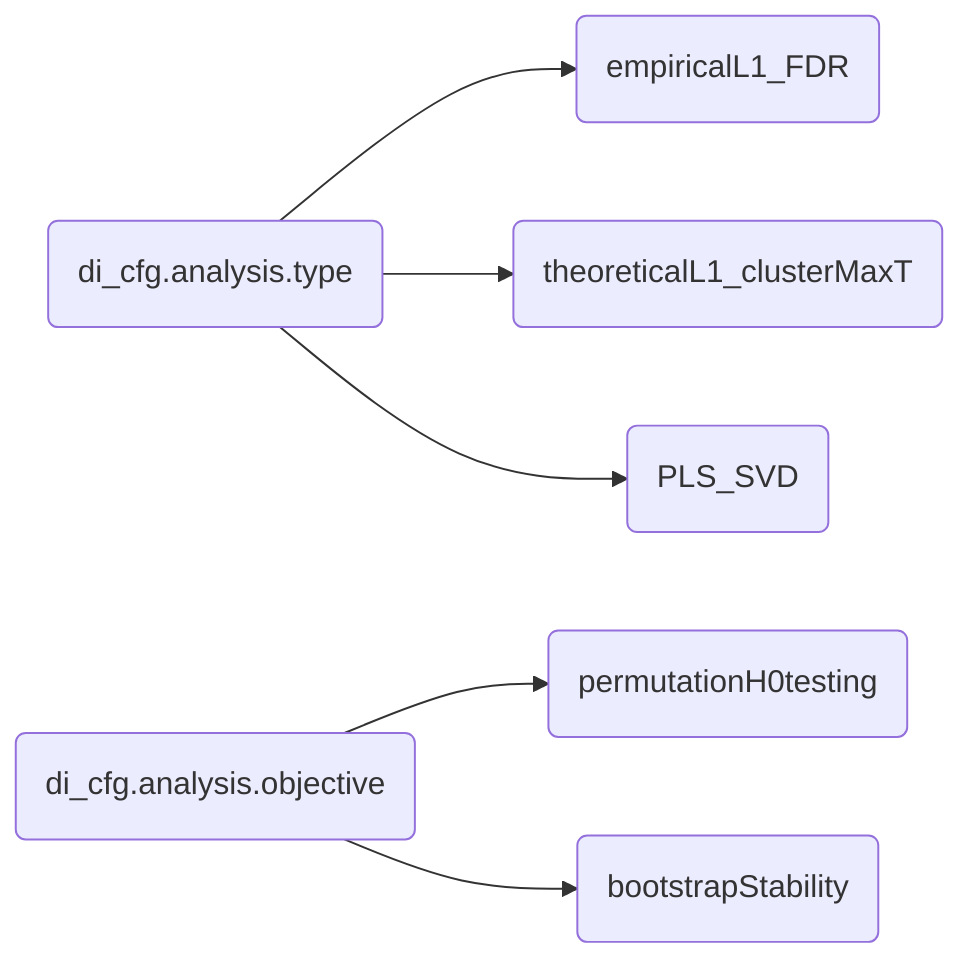

# _Diagonale_ for MATLAB (formerly PhysioExplorer)

Author: Germano Gallicchio, [Bangor University](https://www.bangor.ac.uk/)

Code developed on MATLAB R2025b on a Linux OS (Kubuntu).

## Prerelease status
Diagonale is currently in a prerelease status.
Some analysis paths still contain interactive prompts (e.g., dialogs requesting choices) and a few debugging stops used for development.

## Overview

Not yet available.

## Documentation

Documentation for Diagonale is available at this [link](https://germanogallicchio.github.io/PhysioExplorer_documentation/index.html)

## Tutorials

Not yet available.

## Installation

Not yet available.

## How to contribute

Not yet available.

## How to cite

Gallicchio, G. (2025). Diagonale (formerly PhysioExplorer). Zenodo. (https://doi.org/10.5281/zenodo.16808782)[https://doi.org/10.5281/zenodo.16808782]

---

## Overview
**Diagonale** is a set of functions to extract patterns from multivariate physiological data. 

Testing effects on datasets with many and correlated variables (i.e., multivariate)--or even much larger than the number of observations (i.e., megavariate, Eriksson et al., 2013)--can be challenging due to the multiple comparison problem. (See the [green jelly bean comic](https://xkcd.com/882).) This challenge can be overcome through various approaches.
1. One solution is to run mass (i.e., a lot of) univariate tests and then correct for False Discovery Rate (e.g., Benjamini & Hochberg, 1995).
2. Another solution is to still run mass univariate tests and then cluster their results where there is contiguity in some physical dimension (e.g., time, frequency, sensor space). Then compute cluster metrics (e.g., their statistical mass) and perform inference on them (Groppe et al., 2011; Maris & Oostenveld, 2007).
3. Another solution is to find the combination of the whole set of features that best describes behavioral data or experimental design group/condition (Add reference).

If hypothesis testing is not the goal, but rather stability of the statistical metric across sampling variability, the bootstrap framework provides such metrics.

## What Diagonale's current version can do
[X] = PE can do it
 
[~] = PE can do it with interactive prompts and/or debugging stops in prerelease paths
 
[ ] = PE cannot _yet_ do it
 
| analysis & objective | symmetric association between variables | compare groups | compare levels of one repeated-measure factor
| ---: | :---: | :---: | :---: | 
| empiricalFeature_inferenceFeature permutation             | [~] (2 variables)     | [X] (2 groups)   | [X] (2 levels) |
| empiricalFeature_inferenceFeature bootstrap               | [~] (2 variables)     | [~] (2 groups)   | [~] (2 levels) |
| parametricFeature_inferenceFeature permutation            | [~] (2 variables)     | [~] (2 groups)   | [~] (2 levels) |
| parametricFeature_inferenceFeature bootstrap              | [ ] (2 variables)     | [ ] (2 groups)   | [ ] (2 levels) |
| parametricFeature_inferenceCluster permutation            | [~] (2 variables)     | [X] (2 groups)   | [X] (2 levels) |
| parametricFeature_inferenceCluster bootstrap              | [ ] (2 variables)     | [ ] (2 groups)   | [ ] (2 levels) |
| PLS_SVD permutation                     | [X] (2 variable sets) | [X] (2+ groups)  | [X] (2+ levels) |
| PLS_SVD bootstrap                       | [X] (2 variable sets) | [X] (2+ groups)  | [X] (2+ levels) |

---

## Referencing:  
If you use Diagonale, please cite the Zenodo DOI

Example:

Gallicchio, G. (2025). Diagonale (formerly PhysioExplorer). Zenodo. [https://doi.org/10.5281/zenodo.16808782](https://doi.org/10.5281/zenodo.16808782)

---

## Documentation
_(this documentation is an unpolished draft)_
Diagonale can perform any combination of _analysis_ and _objective_ described below in both multivariate and megavariate contexts (with no distinction). 

## Analysis (di_cfg.analysis)

### Univariate Analysis Naming Convention

Univariate analyses use a two-part naming scheme: `[nullType]Feature_inference[Location]`

**First part - Null Distribution Type:**
- `empirical` = Empirical null via permutation resampling
- `parametric` = Theoretical null via parametric distribution (e.g., t-distribution)

**Second part - Inference Location:**
- `Feature` = Inference at individual feature level (with FDR or maxT correction)
- `Cluster` = Inference at cluster level (cluster-based maxT correction)

**Three Available Analysis Types:**

1. **`empiricalFeature_inferenceFeature`** - Empirical permutation null, feature-level FDR correction
2. **`parametricFeature_inferenceFeature`** - Parametric t-distribution null, feature-level maxT correction
3. **`parametricFeature_inferenceCluster`** - Parametric t-distribution null, cluster-level maxT correction

**Why no `empiricalFeature_inferenceCluster`?**
This would require nested permutation loops: an inner loop to derive empirical p-values at each feature, and an outer loop to build the cluster metric null distribution. This results in N² permutations (e.g., 10,000 × 10,000 = 100 million iterations), making it computationally infeasible. The standard solution uses parametric feature-level statistics for cluster analysis, requiring only a single permutation loop.

---

### 'empiricalFeature_inferenceFeature'
Performs mass univariate tests with **empirical permutation-based null distributions** at the feature level. P-values are computed by comparing observed test statistics against the distribution of statistics obtained from permuted data. False Discovery Rate (FDR) correction controls for multiple comparisons across features. Optionally, clusters can be formed descriptively (without inference).

### 'parametricFeature_inferenceFeature'
Performs mass univariate tests using **parametric null distributions** (e.g., t-distribution for t-tests, correlation theory for correlations). P-values are derived analytically from theoretical distributions. MaxT correction controls the family-wise error rate across features. Optionally, clusters can be formed descriptively (without inference).

### 'parametricFeature_inferenceCluster'
**Cluster-level analysis** (Groppe et al., 2011; Maris & Oostenveld, 2007) is a two-step procedure: (1) compute univariate test statistics using **parametric null distributions**, evaluate them to get p-values, and threshold them, (2) form spatial/temporal/spectral clusters of suprathreshold points. Clusters can be defined in a 3-dimensional space (e.g, time-frequency-channel, frequency-frequency-channel) or a lower-dimensional subset (e.g., time-channel, time-frequency, frequency-channel, time). At the heart of the code is a cluster forming algorithm that combines adjacency criteria (e.g., spatial-temporal-spectral) with the results of univariate statistical testing (e.g., p-values). The code forms clusters on the observed data and, depending on the _objective_, many sets of surrogate data artificially created under the null hypothesis of exchangeability of group/condition labels (permutation) or many replicates, each with sampling variability, of the original data (bootstrap). The surrogate data are sampled through the Monte-Carlo approach. **Inference is performed at the cluster level using maxT correction on cluster metrics** (e.g., cluster mass). 

### 'PLS_SVD'
**SVD-based Partial Least Squares** is a form of symmetric covariance mapping (Note: SVD stands for singular value decomposition.) It handles multi/megavariate data structures natively (in one step) to find combinations of features that best describe the linear associations between two sets of variables. The number of combinations found depends on how much linear independence is in the combined data (the rank). Each combination is characterized by the singular value, informing on how much this combination explains of the covariance, and two singular vectors (one for each variable set), telling how the original variables should be weighted to form that specific combination. Resampling statistics are then used to evaluate whether a certain mapping has a magnitude larger than noise (permutation testing on the singular value based metrics) or whether a certain combination's weights are stable under sampling variability (bootstrap evaluation on the weights).

## Objective (di_cfg.objective)
### 'permutation' (di_cfg.objective = permutationH0testing)
**Permutation** is for null-hypothesis testing. In each Monte-Carlo iteration, group/condition labels are shuffled, and the statistics are recomputed. The code compares the observed cluster metrics (e.g., cluster mass, singular value) with the distribution of the same metrics under the null hypothesis to evaluate their statistical significance. (Note: for cluster analysis, inference is done at the cluster level and not at the point level.)
### 'bootstrap' (di_cfg.objective = bootstrapStability)
**Bootstrap** is for stability estimation.

---

## Wish list (maybe future updates)
- cross validation for generalizability evaluation (high priority, but highest effort, upcoming need). this will require a big update to Diagonale structure (hopefully definitive structure and 1.0.x release)
- cluster descriptives: effect size for group/condition comparison (low priority, very low effort, no need for me)
- enable 3d di_view functions (e.g., channels, time, frequency) using imagesc() instead of plot() waveforms (medium priority, low effort, medium need for me right now)
- write tutorials on how to use Diagonale (medium priority, low effort, low need for me right now)
- improve own version of topoplot to allow spherical interpolation (very low priority, high effort, no need for me in sight)

## References

Benjamini, Y., & Hochberg, Y. (1995). Controlling the false discovery rate: a practical and powerful approach to multiple testing. Journal of the Royal statistical society: series B (Methodological), 57(1), 289-300. https://doi.org/10.1111/j.2517-6161.1995.tb02031.x

Eriksson, L., Byrne, T., Johansson, E., Trygg, J., & Vikström, C. (2013). Multi-and megavariate data analysis basic principles and applications. Umetrics Academy.

Groppe, D. M., Urbach, T. P., & Kutas, M. (2011). Mass univariate analysis of event‐related brain potentials/fields I: A critical tutorial review. Psychophysiology, 48(12), 1711-1725.

Maris, E., & Oostenveld, R. (2007). Nonparametric statistical testing of EEG-and MEG-data. Journal of neuroscience methods, 164(1), 177-190.

